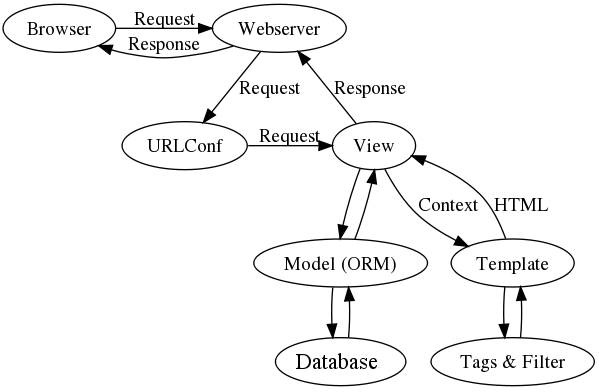

=================================
Chapter 1: Introduction to Django
=================================

This book is about Django, a Web development framework that saves you time
and makes Web development a joy. Using Django, you can build and maintain
high-quality Web applications with minimal fuss.

Here's an example Python CGI script that displays the ten most recently
published books from a database. Don't worry about syntax details; just get a
feel for the basic things it's doing::

    #!/usr/bin/env python

    import MySQLdb

    print "Content-Type: text/html\n"
    print "<html><head><title>Books</title></head>"
    print "<body>"
    print "<h1>Books</h1>"
    print "<ul>"

    connection = MySQLdb.connect(user='me', passwd='letmein', db='my_db')
    cursor = connection.cursor()
    cursor.execute("SELECT name FROM books ORDER BY pub_date DESC LIMIT 10")

    for row in cursor.fetchall():
        print "<li>%s</li>" % row[0]

    print "</ul>"
    print "</body></html>"

    connection.close()

First, to fulfill the requirements of CGI, this code prints a "Content-Type"
line, followed by a blank line. It prints some introductory HTML, connects to a
database and runs a query to retrieve the names of the latest ten books.
Looping over those books, it generates an HTML list of the titles. Finally, it
prints the closing HTML and closes the database connection.

With a one-off page like this one, the write-it-from-scratch approach isn't
necessarily bad. For one thing, this code is simple to comprehend -- even a
novice developer can read these 16 lines of Python and understand everything it
does, from start to finish. There's nothing else to learn, no other code to
read. It's also simple to deploy: just save this code in a file that ends with
".cgi", upload that file to a Web server, and visit that page with a browser.

But despite its simplicity, this approach has a number of problems and
annoyances. Ask yourself these questions:

* What happens when multiple parts of your application need to connect to
  the database? Surely that database-connecting code shouldn't need to be
  duplicated in each individual CGI script. The pragmatic thing to do would
  be to refactor it into a shared function.

* Should a developer really have to worry about printing the
  "Content-Type" line and remembering to close the database connection?
  This sort of boilerplate reduces programmer productivity and introduces
  opportunities for mistakes. These setup- and teardown-related tasks would
  best be handled by some common infrastructure.

* What happens when this code is reused in multiple environments, each with
  a separate database and password? At this point, some
  environment-specific configuration becomes essential.

* What happens when a Web designer who has no experience coding Python
  wishes to redesign the page? One wrong character could crash the entire
  application. Ideally, the logic of the page -- the retrieval of book
  titles from the database -- would be separate from the HTML display of
  the page, so that a designer could edit the latter without affecting the
  former.

These problems are precisely what a Web framework intends to solve. A Web
framework provides a programming infrastructure for your applications, so that
you can focus on writing clean, maintainable code without having to reinvent
the wheel. In a nutshell, that's what Django does.

The MVC Design Pattern
======================

Let's dive in with a quick example that demonstrates the difference between the
previous approach and a Web framework's approach. Here's how you might write
the previous CGI code using Django. The first thing to note is that that we
split it over four Python files (``models.py``, ``views.py``, ``urls.py``) and
an HTML template (``latest_books.html``)::

    # models.py (the database tables)

    from django.db import models

    class Book(models.Model):
        name = models.CharField(max_length=50)
        pub_date = models.DateField()

    # views.py (the business logic)

    from django.shortcuts import render
    from models import Book

    def latest_books(request):
        book_list = Book.objects.order_by('-pub_date')[:10]
        return render(request, 'latest_books.html', {'book_list': book_list})

    # urls.py (the URL configuration)

    from django.conf.urls import url
    import views

    urlpatterns = [
        url(r'^latest/$', views.latest_books),
    ]

    # latest_books.html (the template)

    <html><head><title>Books</title></head>
    <body>
    <h1>Books</h1>
    <ul>
    
    <li>{{ book.name }}</li>
    
    </ul>
    </body></html>

Again, don't worry about the particulars of syntax; just get a feel for the
overall design. The main thing to note here is the *separation of concerns*:

* The ``models.py`` file contains a description of the database table,
  represented by a Python class. This class is called a *model*. Using it,
  you can create, retrieve, update and delete records in your database
  using simple Python code rather than writing repetitive SQL statements.

* The ``views.py`` file contains the business logic for the page. The
  ``latest_books()`` function is called a *view*.

* The ``urls.py`` file specifies which view is called for a given URL
  pattern. In this case, the URL ``/latest/`` will be handled by the
  ``latest_books()`` function. In other words, if your domain is
  example.com, any visit to the URL http://example.com/latest/ will call
  the ``latest_books()`` function.

* The ``latest_books.html`` file is an HTML template that describes the
  design of the page. It uses a template language with basic logic
  statements -- e.g., ````.

Taken together, these pieces loosely follow a pattern called
Model-View-Controller (MVC). Simply put, MVC is way of developing software so
that the code for defining and accessing data (the model) is separate from
request-routing logic (the controller), which in turn is separate from the user
interface (the view). 

   Figure 1-1. MVC Design Pattern

Required Programming Knowledge
------------------------------

Readers of this book should understand the basics of procedural and
object-oriented programming: control structures (e.g., ``if``, ``while``,
``for``), data structures (lists, hashes/dictionaries), variables, classes and
objects.

Experience in Web development is, as you may expect, very helpful, but it's
not required to understand this book. Throughout the book, we try to promote
best practices in Web development for readers who lack this experience.

Required Python Knowledge
-------------------------

At its core, Django is simply a collection of libraries written in the Python
programming language. To develop a site using Django, you write Python code
that uses these libraries. Learning Django, then, is a matter of learning how
to program in Python and understanding how the Django libraries work.

If you have experience programming in Python, you should have no trouble diving
in. By and large, the Django code doesn't perform a lot of "magic" (i.e.,
programming trickery whose implementation is difficult to explain or
understand). For you, learning Django will be a matter of learning Django's
conventions and APIs.

If you don't have experience programming in Python, you're in for a treat.
It's easy to learn and a joy to use! Although this book doesn't include a full
Python tutorial, it highlights Python features and functionality where
appropriate, particularly when code doesn't immediately make sense. Still, we
recommend you read the official Python tutorial, available online at
http://docs.python.org/tut/. We also recommend Mark Pilgrim's free book
*Dive Into Python*, available at http://www.diveintopython.net/ and published in
print by Apress.

Required Django Version
-----------------------

This book covers Django 2.0.

Django's developers maintain backwards compatibility as much as possible, but
occasionally introduce some backwards incompatible changes.  The changes in each
release are always covered in the release notes, which you can find here:
https://docs.djangoproject.com/en/dev/releases/2.0

Getting Help
------------

One of the greatest benefits of Django is its kind and helpful user community.
For help with any aspect of Django -- from installation, to application design,
to database design, to deployment -- feel free to ask questions online.

* The django-users mailing list is where thousands of Django users hang out
  to ask and answer questions. Sign up for free at http://www.djangoproject.com/r/django-users.

* The Django IRC channel is where Django users hang out to chat and help
  each other in real time. Join the fun by logging on to #django on the
  Freenode IRC network.

What's Next
-----------

In `Chapter 2`_, we'll get started with Django, covering installation and
initial setup.

.. _Chapter 2: chapter02.html
